# V0 Architecture Diagrams

Diagramas Mermaid para visualizar o modelo de dados e os principais fluxos da V0.

## ER — visão geral

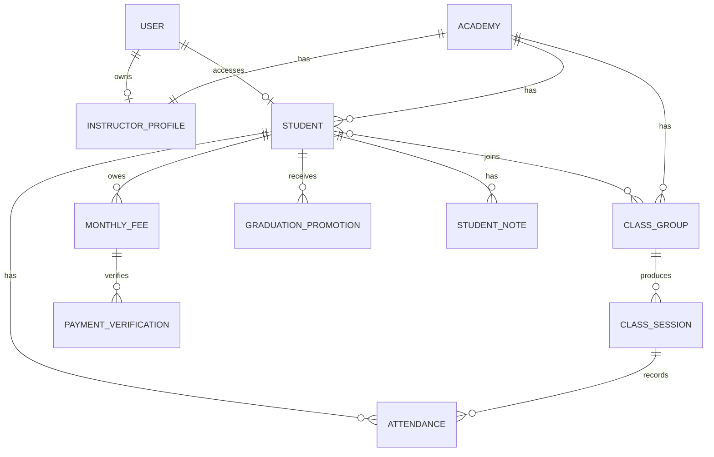

## ER — academia, usuários e acesso do aluno

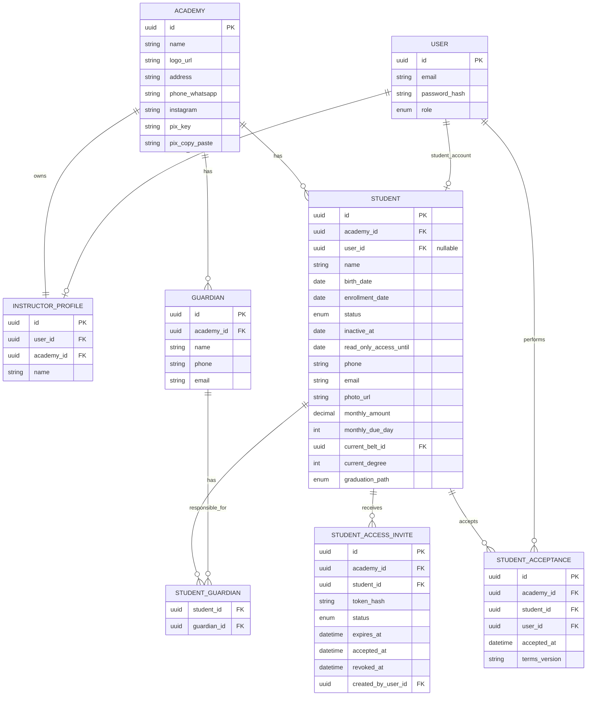

## ER — turmas, agenda e presenças

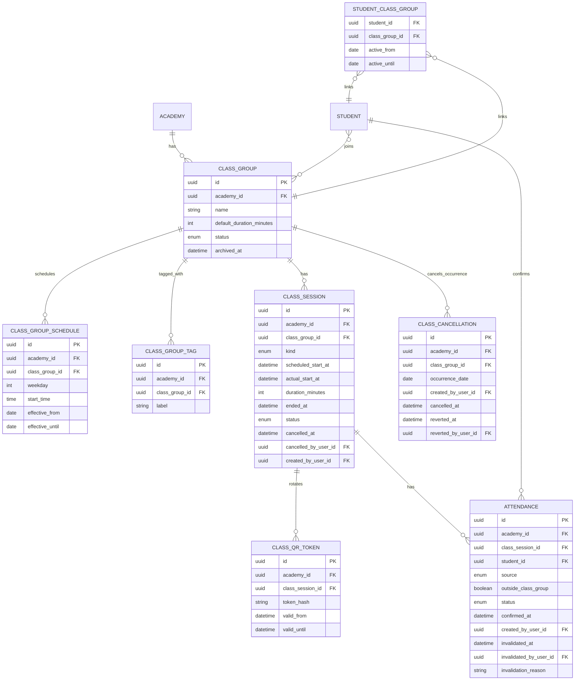

## ER — graduação

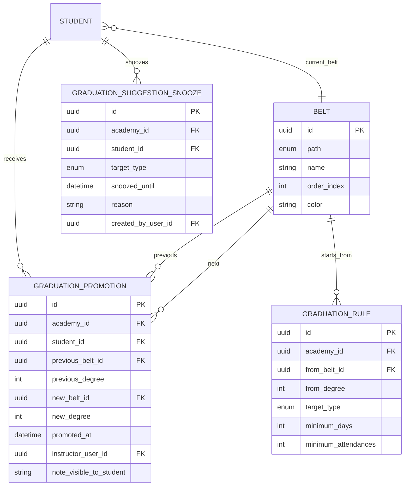

## ER — mensalidades, Pix e verificações

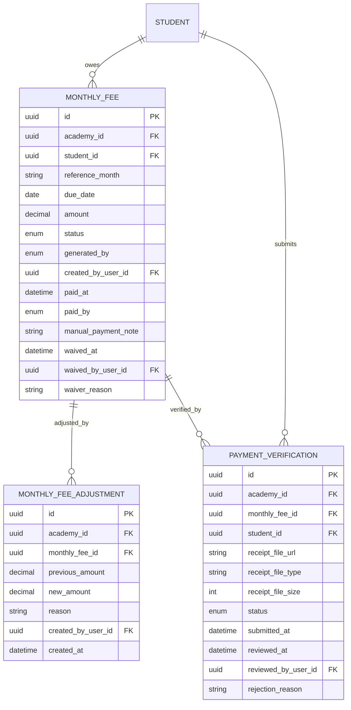

## ER — anotações e importação

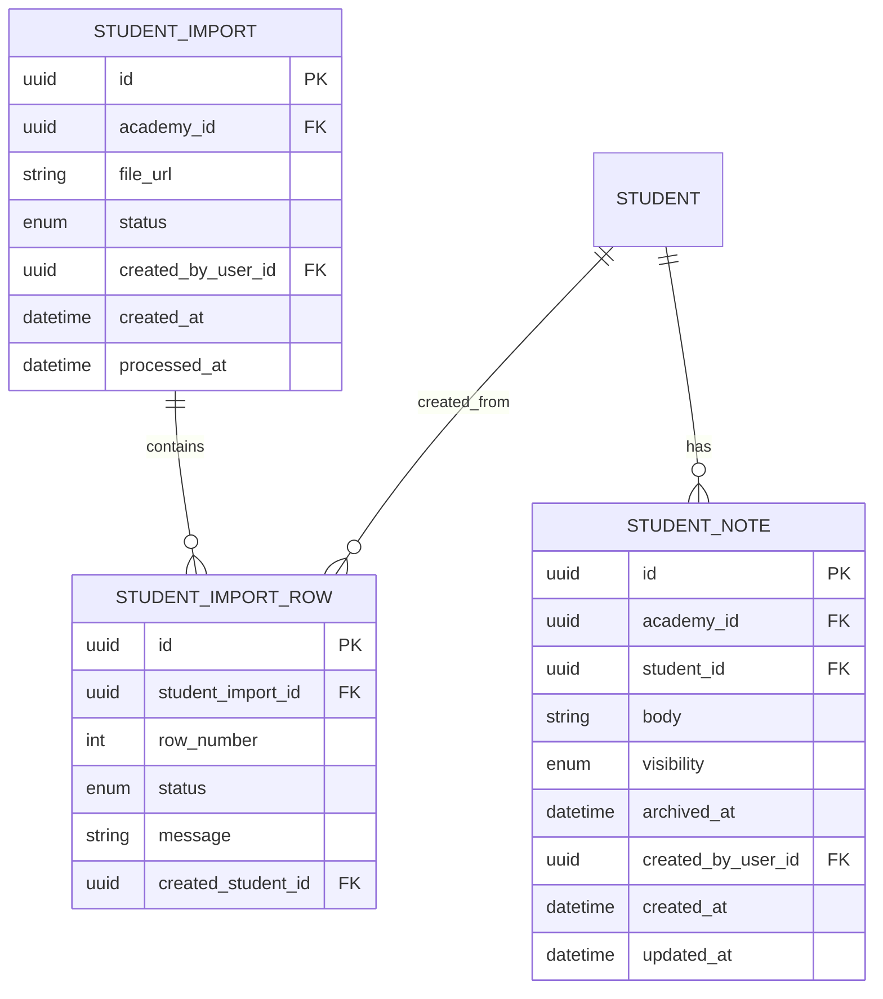

## Sequência — convite e primeiro acesso do aluno

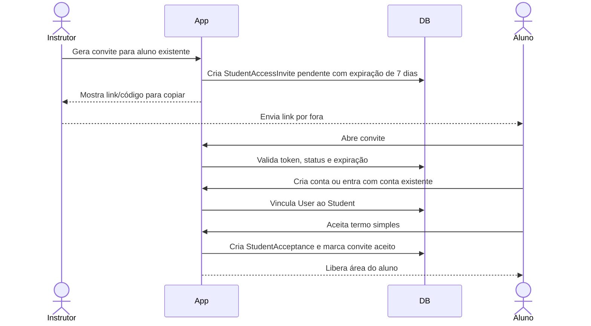

## Sequência — chamada com QR e confirmação de presença

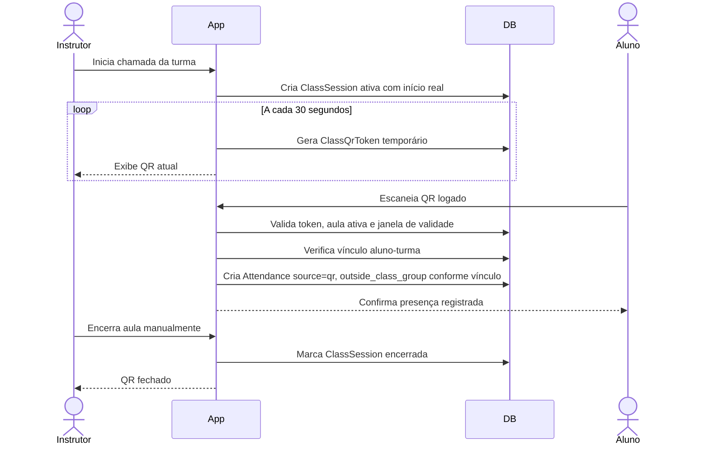

## Sequência — presença manual e invalidação

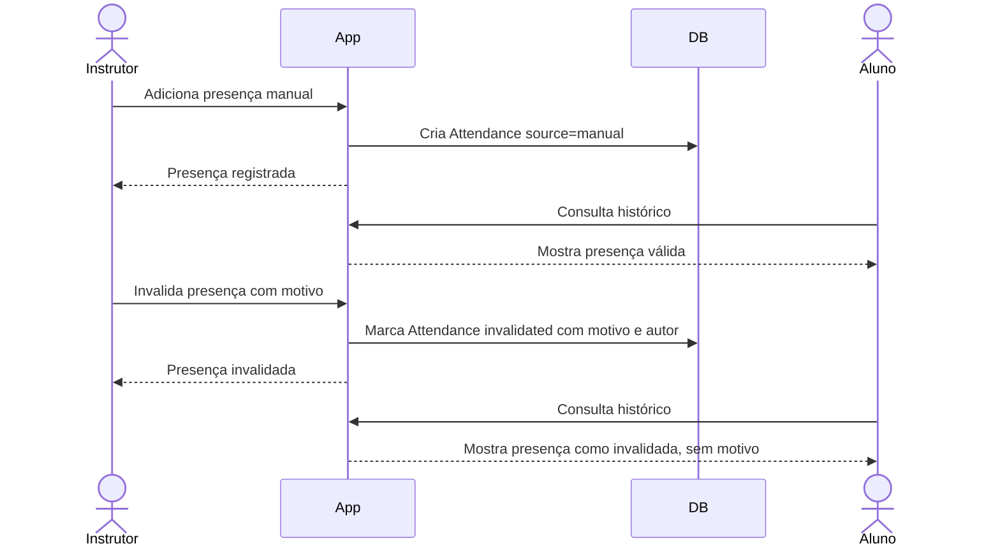

## Sequência — geração de mensalidade e verificação Pix

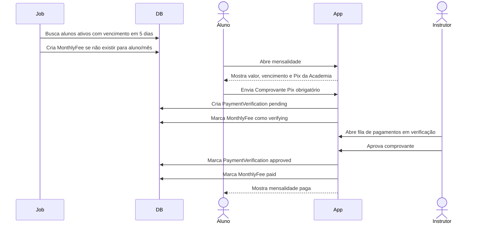

## Sequência — rejeição e reenvio de comprovante

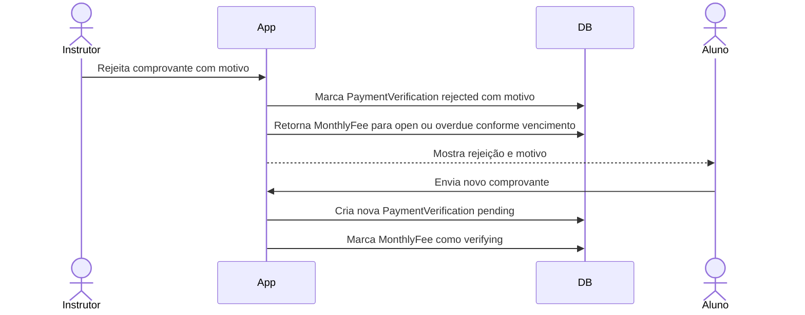

## Sequência — elegibilidade e promoção de graduação

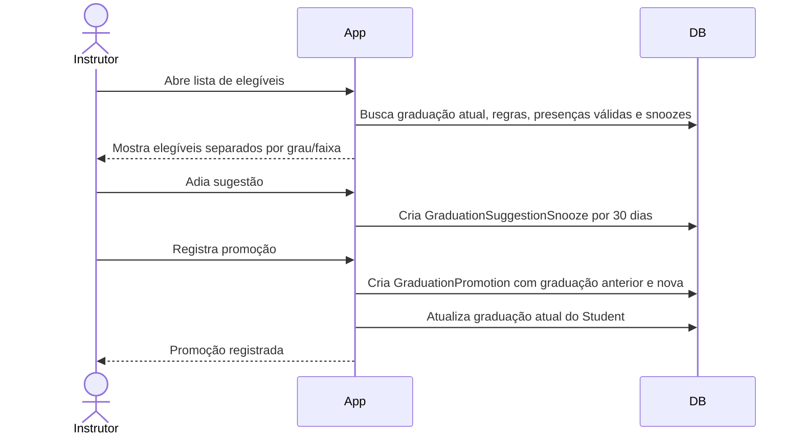

## Sequência — cancelamento de aula prevista

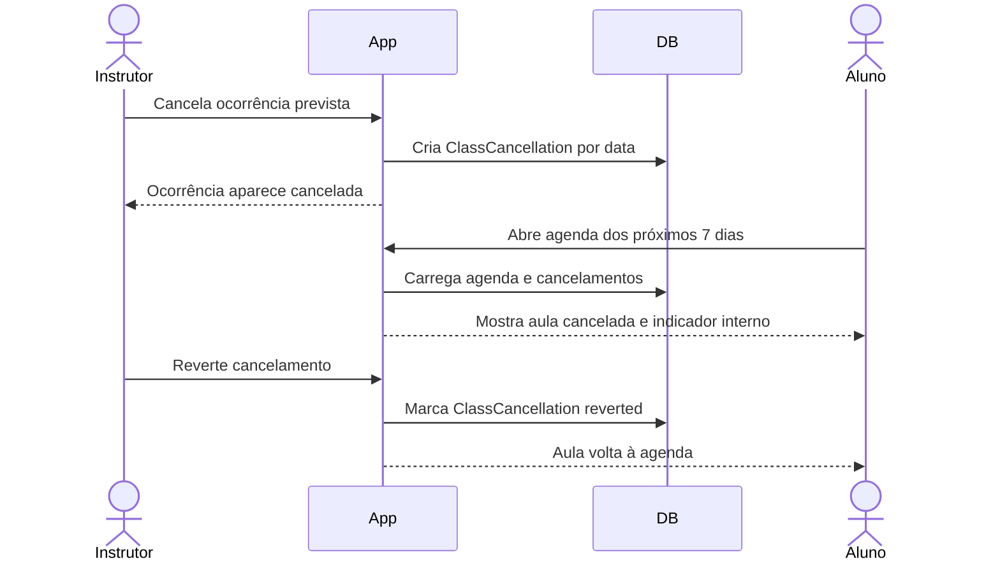
